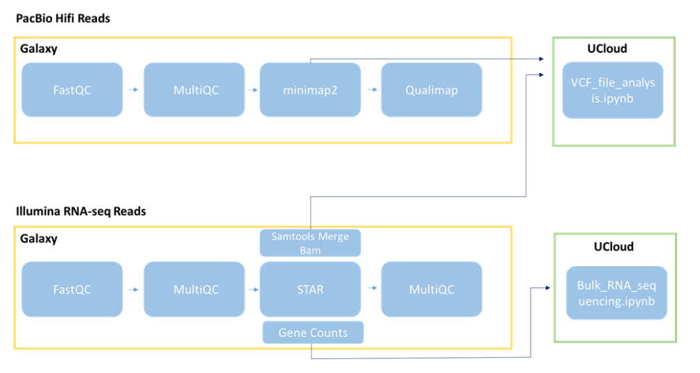
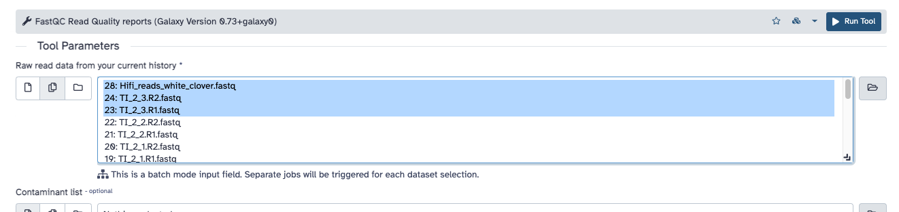
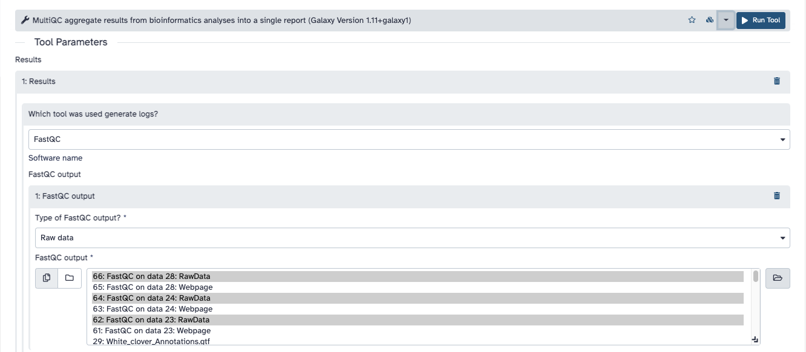
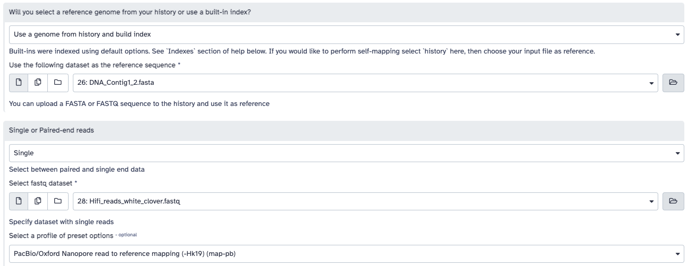
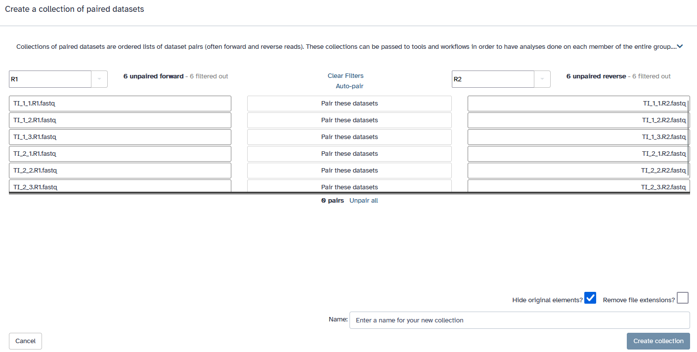
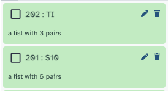

# Quality Control and Alignment of raw reads

This first exercise will be executed on `Galaxy`, an interactive platform to run bioinformatics workflows. We will replicate this lesson with computer code later in this course. `Galaxy` has the possibility of working with a free account.

## Biological introduction

White clover (*Trifolium repens*) is an **allotetraploid**. This means that it contains genomes
originating from two different species within the same nucleus. Normally, white clover is an
outbreeding species, but a self-compatible line was used for [sequencing the white clover
genome](https://academic.oup.com/plcell/article/31/7/1466/5985684). This line is
designated `S10` in your data, indicating that this is the 10th self-fertilized generation. In
addition, you have data from a wild clover accession (ecotype) called Tienshan (`Ti`), which is
collected from Chinese mountains and is adapted to alpine conditions. 

*Figure: Characterisation of the white clover population. T.Repens is a hybrid of T.Occidentale and T.Pallescens*

## Exercise guide

### Prepare the tools and data

1. Install IGV on your computer from [here](https://software.broadinstitute.org/software/igv/download). This is a genome browser you will use to look at some files.
2. Create an account at [usegalaxy.org](https://usegalaxy.org) and log into galaxy.
3. Find the course data by going to [this web address](https://usegalaxy.org/u/samuele.soraggi/h/ngs2023) and by clicking on `Import this history` (top left corner of the page).

#### Data

You will be working with two types of sequencing data.
The first is *PacBio Hifi reads*, which are long and accurate. You can find them under
Hifi_reads_white_clover.fastq.
The second type is *Illumina RNA-seq reads*, which are short and accurate and should be aligned
using [a spliced aligner, such as STAR](https://youtu.be/XbBS9o-4100).

There are 24 of these files, 12 for each of the two genotypes mentioned
before. The files are named `[genotype]_[treatment]_[replicate].fastq`. Treatment 1 is before and
treatment 2 is after exposure to frost, respectively.

In addition to the sequencing data, there are also three reference files: one for homologous contig 1 (referencing T. occidentale-derived subgenome), one for contig 2 (T.
pallescens-derived subgenome) and one for both Contigs 1 and 2. The reference files are in `fasta` format.

The file `white_clover_genes.gtf` contains the gene annotations for the two contigs.

#### Workflow illustration

Through `Galaxy`, we build a workflow applying tools to the data. We will look at the quality of the raw reads for both PacBio HiFi and Illumina RNA-seq reads. Afterwards, we align to references, using two different tools for the two types of data. Finally, we will look at the alignments on a genome browser. We will work then on a computing cluster through `uCloud` to analyze the aligned data in some of the upcoming lessons of the course.

### Galaxy Workflow

   When you import the files, what you actually import is a **History** - a sequence of files and softwares applied on the data. You can see the history on the right side of your *usegalaxy.org* webpage with green panels. Here, we only have the starting data, and you will build the rest of your history through various tools.

   

   On the left side of the screen, you have a menu with various available tools organized by category. All those softwares are also available on a classical computing command line (we will try those as well).

      

#### Quality control

**1)** Run FastQC on the PacBio Hifi reads and on two of the Illumina RNA-seq libraries. FastQC does quality control of the raw sequence data, providing an overview of the data which can help identify if there are any problems that should be addressed before further analysis. 
   
In the tool menu, click on `FASTQ quality control --> FASTQC read quality reports`. You will see a window with *tool parameters*: for the first option (raw read data from history), choose multiple files and select `Hifi_reads_white_clover.fastq` plus other `fastq` files you want to see the quality of (example in figure below).  Then click on the button `Run Tool`.

You will notice that some new elements are added to your history. Part of them are `FastQC` producing a text file, while others are `FastQC` producing a webpage report. The reports are ready when coloured in green: click on the *eye symbol* of a history item to read a report.

**2** FastQC provides a report for each sample. To have a better comparison between
the *Hifi* and *Illumina* data, we would combine the three `FastQC` reports into one using `MultiQC`.

Choose the MultiQC tool from `FASTQ quality control --> MultiQC aggregate results from ...`. In the options, select `FastQC` as the used tool for the logsselect FastQC as the tool used to generate the output, and then select the items of `FastQC` of your history producing `RawData` (Figure below). In this way, you build a pipeline from the previous reports to the new tool you are using. Now click on `Run Tool`.

The tool will be now running in your history. When it is done, click on the *eye symbol* to see the report.

select the three “RawData” outputs generated by FastQC. Visualize the Webpage generated by
MultiQC.
Hint: You can find a “Help” button that offers additional information about the plots for each panel.

Questions:

<i>Focus on the following panels: “Per base sequence quality”, “Per sequence quality scores”…. (“Per base sequence content” always gives a FAIL for RNA-seq data). What do you notice with respect to the sequence quality scores? And are there any other quality issues worth noting?
</i>

#### Hifi Data Alignment

**3** Map the PacBio Hifi reads (`Hifi_reads_white_clover.fastq`) to the white clover reference sequence (Contigs 1 and 2) using `minimap2` (Map with minimap2). Find `Genomics Analysis --> Mapping --> Map with minimap2`. In the options, do not leave `Use a built-in genome index`, but select the option for having a genome from history. Choose then `DNA_Contig1_2.fasta` as the reference sequence.

Under the profile with preset options, choose `PacBio/Oxford Nanopore read to reference mapping (map-pb)`. Then click on `Run Tool`.

**4** Run the same alignment, but choose as preset options `Long assembly to reference mapping. Divergence is far below 20% (asm20)`.

Rename then the two alignments using the edit function (*pen symbol* in the history). Use for example names `Contig1_2_mappb` and `Contig1_2_asm20`, to distinguish alignment options and reference genome.

**5** The aligned genomes are not sorted by coordinates. Sort the alignments using `Samtools sort` (Find the tool under `Genomic file manipulation --> SAM/BAM --> Samtools sort ...`). In the options, choose the two aligned files with multiple selection. Then click on `Run Tool`.

**6** Download the two alignments to your computer. To do so, click on the *disk symbol* of each file in your history, and for each download both the Dataset (alignments in `bam` format) and their index files (in `bai` format). Download as well the reference genome in `fasta` format (`DNA_Contig1_2.fasta` from the history).

**7** Open IGV on your computer. Load the reference first: go on `Genome --> Load genome from file` and select the `fasta` file you downloaded. Then load the two alignments: go on `File --> Load from file` and select the `bam` and `bai` files you downloaded, together. You can now visualize the alignments.

Questions:

<i> Look at the alignments in IGV. What do you notice about the alignments? What is the difference between the two alignments? Do you think one of them is better than the other? Choose on of the two alignments for the next steps.
</i>

**8** Repeat the alignment with Minimap2 (using the chosen alignment option from the question above) and the sorting, but using the reference genomes for Contig 1 and for Contig 2 searaately. **Note:** you can run all at once by choosing multiple reference genomes in the options!

Questions:

<i> Download the two references for Contig 1 and 2, and the two sorted alignments. Load the references from the menu `Genomes` in IGV, and then open the two alignments using the menu `File` in IGV.

- Why do you see fluctuations in coverage and large regions without any apparent subgenome
SNPs?

- What are the major differences between the stats for the reads mapped to Contigs1&2
versus contig1 and contig2? What is your interpretation of the differences?
</i>

#### RNA Data Alignment

**9** First, group the 24 RNA-seq libraries into two dataset lists, one list of pairs for S10 libraries and
another for Tienshan libraries. so we can work with multiple samples simultaneously.
You can do this by selecting the libraries for each genotype and choosing `Build Lists of Dataset
Pairs`. 

The grouping suggested by Galaxy is wrong, because the paired reads are paired according to `_1` and `_2` in their names. Change those two with `R1` and `R2`, click on `Unpair all`, and then click on the suggested corrected pairs with the buttons `Pair these datasets`.

Your sequences will be substituted by two elements in your history. Here we chose for example to name them `S10` and `TI`.

**10** Do alignment of the RNA-seq lists of raw files to the reference `DNA_Contig1_2.fasta` using `STAR`. Go to `Genomics analysis --> RNA-seq --> RNA STAR Gapped-read mapper for RNA-seq data`. In the options use:

- as data, the parameter `Paired-end (as collection)`, and then choose one of the two collections (you cannot run them all at once)
- as reference, `DNA_Contig1_2.fasta`, with Length of SA pre-indexing string equal to `9`
- as index with gene-model, use `white_clover_annotations.gtf`
- as output, `Per gene read counts (GeneCounts)`.

**11** Use `MultiQC` to see the quality of the output. The alignment of `STAR` produces log files which can be used for quality reports. Go on `Genomic File Manipulation --> MultiQC`. In the options select the tool `STAR`. Then `Insert STAR output`, as type of output the `Log`, and choose the two logs listing collections of `STAR` alignments. Then click on `Run Tool`.

View the report to see the alignment statistics.

**Final note:** `Galaxy  can also be used to create an automatic workflow that will map the data. This workflow can be useful when running multiple samples. You can
generate a workflow from the analysis already completed in a history, by going to Settings →
Extract workflow. You can also create a workflow from scratch using the Workflow editor.
