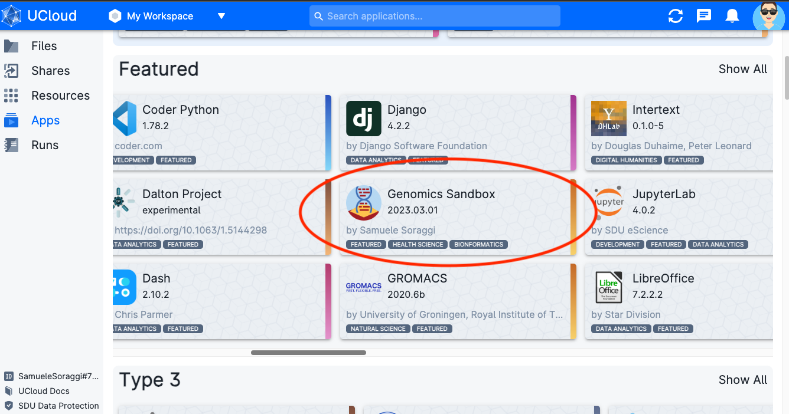
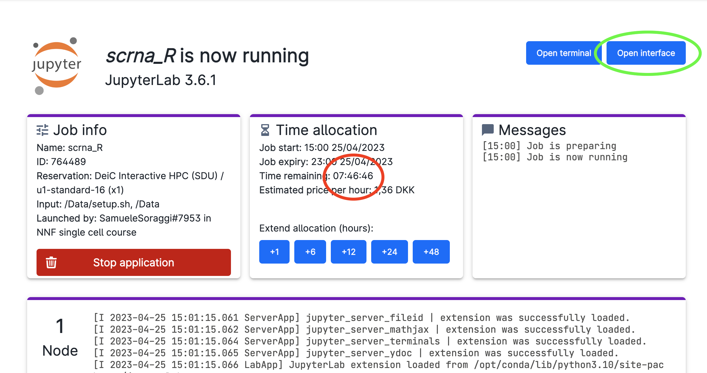
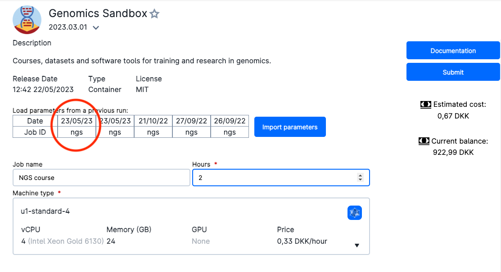
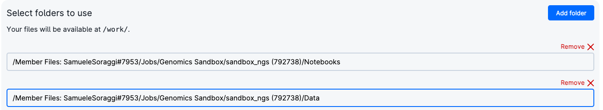

# Access through uCloud

`Ucloud` is an interactive online platform from the [University of Southern Danmark eScience center](https://escience.sdu.dk/) that allows users to execute softwares and computer code directly from their browser. If you have an account from a danish university, hospital, and other institutions, you can access the platform for free and try the course.

## Starting a session of the Introduction to NGS data analysis on uCloud

* Log onto ucloud at the address [http://cloud.sdu.dk](http://cloud.sdu.dk) using the university/institution credentials you possess.

* If you are participating in the NGS Summer Course 2023 in Aarhus, click **AFTER logging in** on [this link](https://cloud.sdu.dk/app/projects/invite/48779752-3cd2-41f7-b497-fc465d24990b). You should see a message on your browser where you have to accept the invitation to the project. This will add you to a project on uCloud, where we have data and extra computing credit for the course. 

* Be sure to be in the right project.  If you are participating in the NGS Summer Course 2023 in Aarhus, choose `NGS Summer Course` from the project menu (red circle). Afterwards, click on the `App` menu (green circle)

**Note:** The project `My Workspace` is instead your private space where you have some free hundreds of CPU hours and GBs of memory.

* Find the app `Genomics Sandbox` (red circle), which is under the title `Featured`.
  

* Click on it. You will get into the settings window. Choose any Job Name (Nr 1 in the figure below), how many hours you want to use for the job (Nr 2, choose at least 2 hours, you can increase this later), and how many CPUs (Nr 3, choose at least 4 CPUs for the first three exercises, but use at least 8 CPUs to run the single cell analysis). Select the `Introduction to NGS Data Analysis` as course (Nr 4). Then click on `Submit` (Nr 5).
  

* You will now enter a waiting queue. When the session starts, the timer begins to count down (red circle). In a couple of minutes you should be able to open the interface through the button (green circle). Note the buttons to add time to your session (blue circle) and the button to stop the session when you are done (pink circle)

## Reuse your notebooks and data

The first time you run the Genomics Sandbox, you download data and notebooks. You can reuse them!

* Open the Genomics Sandbox App and use the settings to run it. You can click on your previous job name to recycle the settings (red circle).

* Now click on `Add Folder` (red circle) and on the appearing browsing bar (green circle). 
 

You need to find a drive with your user name (red circle), written as `Member Files: NameSurname#Number`. Then, go into `Jobs/Genomics Sandbox/JobID/Notebooks` and choose the folder (green circle). `JobID` corresponds to the Job Name you used in the previous session, followed by some random number in parenthesis. 

* Do the same procedure adding a folder again and finding  `Jobs/Genomics Sandbox/JobID/Data`. At the end you should have two added folders like this:

* Click on Submit. Now you will be able to reuse data, results and exercises on which you worked before.
  
**Note:** remember to recycle the settings of this session the next time, so you can actually reuse the data and notebooks without having to add folders.